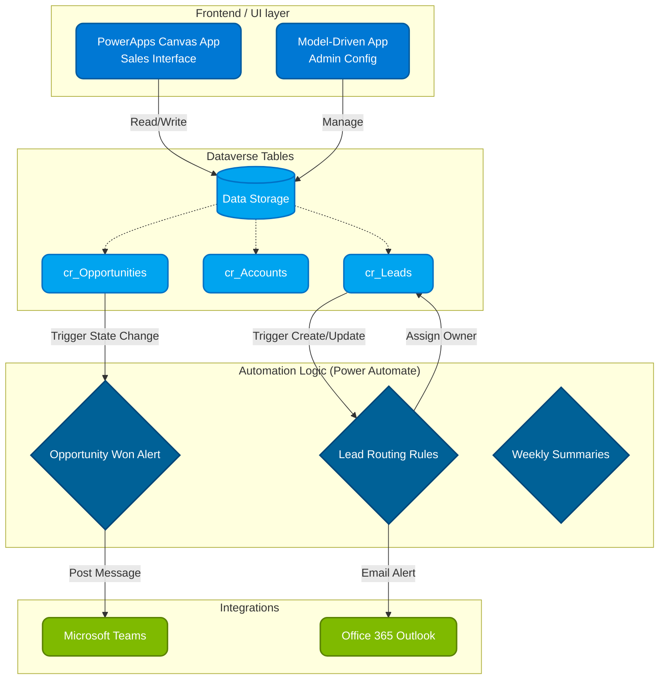

<div align="center">
  
  <h1>CRM Workflow Automation Demonstration</h1>
  <p><strong>A foundational Customer Relationship Management solution built with Microsoft PowerApps & Power Automate.</strong></p>
  
  []()
  [](https://powerapps.microsoft.com/)
  [](https://powerautomate.microsoft.com/)
</div>

<br />


*Figure: Reference Dashboard UI Overview (Kishan Vyas)*

## Project Overview
This repository contains the architecture, schema definitions, and exported workflows for a CRM System built as a demonstration on the Microsoft Power Platform.

The solution was developed to showcase proficiency in implementing a centralized Dataverse schema, building a responsive Canvas PowerApp, and engineering automated logic via Power Automate. It aims to demonstrate how manual data entry can be reduced and standard sales processes can be enforced using modern low-code tools.

### Key Capabilities Demonstrated
* **Automated Lead Routing:** Architected flows that dynamically assign leads based on Regional territories.
* **Unified Dashboard Interface:** Designed a structured view for leads, opportunities, and accounts suitable for a sales team.
* **Data Integrity:** Implemented Dataverse Alternate Keys and validation mechanisms to prevent duplicate CRM entries.
* **System Integration:** Engineered logic to interface with external systems (Microsoft Teams and Office 365 Outlook) for state-change alerts.

---

## System Architecture

The solution utilizes Dataverse as the primary data layer, demonstrating a decoupled and scalable architecture.



---

## Repository Structure

```text
CRM-PowerApps-Workflow/
├── assets/                    
│   └── crm_dashboard_mockup.png   # Reference Dashboard UI Overview
├── src/
│   ├── workflows/                 # Power Automate JSON Logic Exports
│   │   ├── lead_routing_flow.json
│   │   ├── opportunity_won_notification.json
│   │   └── data_cleanup_job.json
│   ├── dataverse_schema/          # Dataverse Table Definitions
│   │   ├── accounts_table.json
│   │   ├── leads_table.json
│   │   └── opportunities_table.json
├── docs/                      
├── CONTRIBUTING.md
└── README.md
```

---

## Data Model Schema (Dataverse)
The CRM demonstrates database normalization via three primary Dataverse tables:

1. **`cr_Lead`**: Captures raw incoming inquiries.
2. **`cr_Account`**: Represents a validated business entity.
3. **`cr_Opportunity`**: Stores potential revenue-generating deals linked to Accounts.

*Refer to the `src/dataverse_schema/` directory for JSON schema details, Picklist options, and relationships.*

---

## Core Workflows Showcased

### 1. Lead Routing
* **Trigger:** Row added to `cr_Lead`.
* **Logic:** Evaluates the `cr_territory` field. If `North India` or `West India`, assigns to the regional sales manager. Otherwise, routes to the Central Sales Queue.
* **Action:** Sends an Office 365 Email to the allocated owner upon successful record assignment.

### 2. Opportunity Notification
* **Trigger:** Status changes to "Won" on `cr_Opportunity`.
* **Logic:** Retrieves linked Account and Revenue values using standard FetchXML operations in Power Automate.
* **Action:** Constructs and posts an Adaptive Card into the relevant Microsoft Teams channel to notify the team.

---

## Setup & Configuration Guide
To import these structural examples into a Power Platform Tenant:

1. Navigate to the [Power Apps Maker Portal](https://make.powerapps.com).
2. Validate you hold the **System Customizer** role.
3. Use the schemas in `src/dataverse_schema/` to define the custom tables natively.
4. Import the provided Logic constructs from `src/workflows/`.
5. Authorize credential handshakes for the Office Outlook and Microsoft Teams connections if necessary.
