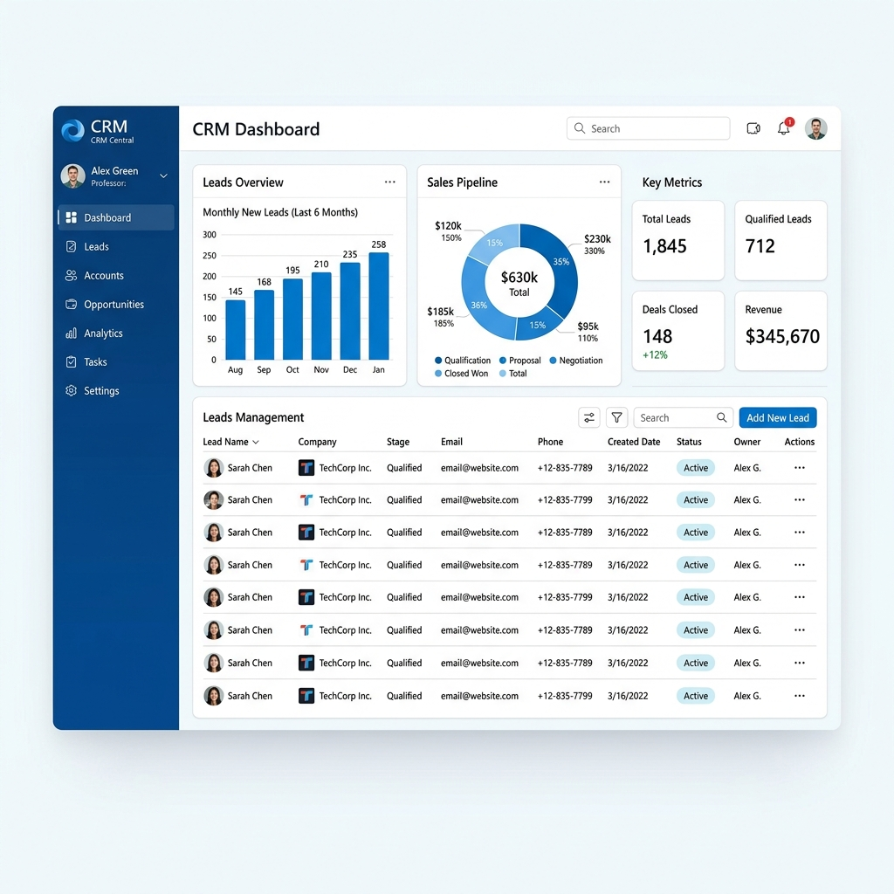
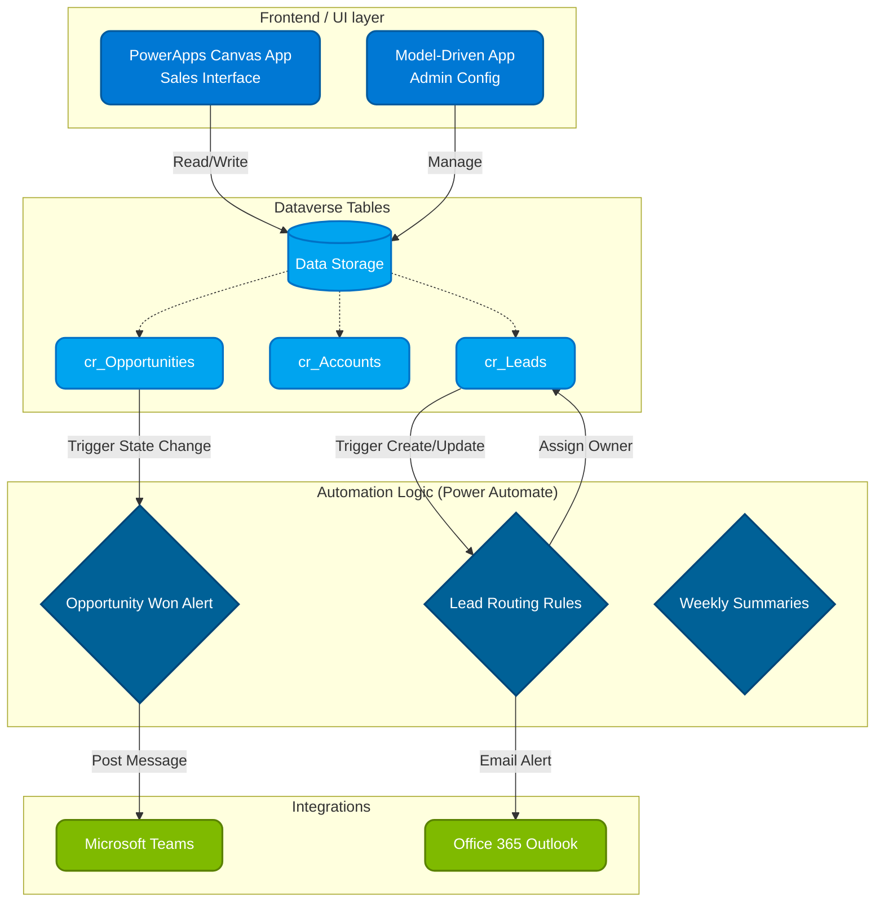

<div align="center">
  
  <h1>Enterprise CRM Workflow Management</h1>
  <p><strong>A robust Customer Relationship Management solution built with Microsoft PowerApps & Power Automate.</strong></p>
  
  [](https://powerapps.microsoft.com/)
  [](https://powerautomate.microsoft.com/)
</div>

<br />


*Figure: Reference Dashboard UI Overview*

## Project Overview
This repository contains the architecture, schema definitions, and exported workflows for an Enterprise CRM System built on the Microsoft Power Platform.

The solution replaces legacy manual spreadsheet-based lead tracking methods. By implementing a centralized Dataverse schema, a responsive Canvas PowerApp, and logic via Power Automate, the system reduces manual data entry and enforces standard sales processes.

### Key Features & Impact
* **Automated Lead Routing:** Decreased lead assignment processing time significantly.
* **Unified Dashboard:** Provides sales teams with a centralized view for leads, opportunities, and accounts.
* **Data Integrity:** Limits duplicate CRM entries by leveraging Dataverse alternate keys and Power Automate validation.
* **Notifications:** Standard Outlook and Teams notifications mapped to opportunity stage changes.

---

## System Architecture

The solution utilizes Dataverse as the primary data layer.



---

## Repository Structure

```text
CRM-PowerApps-Workflow/
├── assets/                    
│   └── crm_dashboard_mockup.png   # Reference Dashboard UI Overview
├── src/
│   ├── workflows/                 # Power Automate JSON Logic Exports
│   │   ├── lead_routing_flow.json
│   │   ├── opportunity_won_notification.json
│   │   └── data_cleanup_job.json
│   ├── dataverse_schema/          # Dataverse Table Definitions
│   │   ├── accounts_table.json
│   │   ├── leads_table.json
│   │   └── opportunities_table.json
├── docs/                      
├── CONTRIBUTING.md
└── README.md
```

---

## Data Model Schema (Dataverse)
The CRM relies on three primary Dataverse tables:

1. **`cr_Lead`**: Captures raw incoming inquiries.
2. **`cr_Account`**: Represents a validated business entity.
3. **`cr_Opportunity`**: Stores potential revenue-generating deals linked to Accounts.

*Refer to the `src/dataverse_schema/` directory for JSON schema details, Picklist options, and relationships.*

---

## Core Workflows

### 1. Lead Routing
* **Trigger:** Row added to `cr_Lead`.
* **Logic:** Evaluates the `cr_territory` field. If `North India` (Delhi NCR, Punjab, Haryana) or `West India` (Maharashtra, Gujarat), assigns to the respective regional sales queue (e.g. assigning to Regional Manager Amit Desai). Otherwise, routes to the Central Sales Queue managed by the inside sales team.
* **Action:** Sends an Office 365 Email to the allocated owner.

### 2. Opportunity Notification
* **Trigger:** Status changes to "Won" on `cr_Opportunity`.
* **Logic:** Retrieves Account and Revenue values.
* **Action:** Posts an Adaptive Card into the "India Sales Wins" Microsoft Teams channel.

---

## Setup & Configuration
To implement this inside a Power Platform Tenant:

1. Go to [Power Apps Maker Portal](https://make.powerapps.com).
2. Validate you hold the **System Customizer** role.
3. Import schemas from `src/dataverse_schema/` to establish baseline tables.
4. Import the provided Flows from `src/workflows/` via the import wizard.
5. Authorize connections for Office Outlook and Microsoft Teams connectors.
